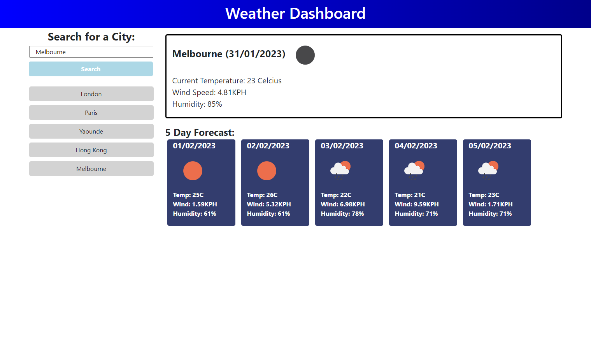

# Weather Forecast

## Description

I have made a JavaScript application with the use of third party API JQuery and the Open Weather Map server API. This allowed me to host current weather and 5 day forecast of any city that the user inputs, using the automatic geo converter to change city names into latitude and longtitude coordinates.

## Usage

When user types in a city the current weather for that place and a 5 day forecast is dynamically generated with jQuery and layed out on the page using bootstrap elements. Every input city creates a button for said city as a way to track what historical input the user puts in.

### Project Page

**Below is the attached link for the deployed application**

Click [here](https://alecerf01.github.io/weather-forecast/) to go to my page.

### Mock-Up

The following image shows the web application's appearance and functionality:

